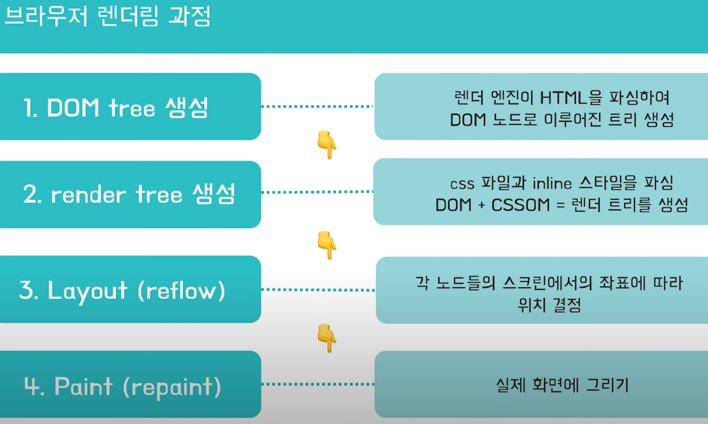
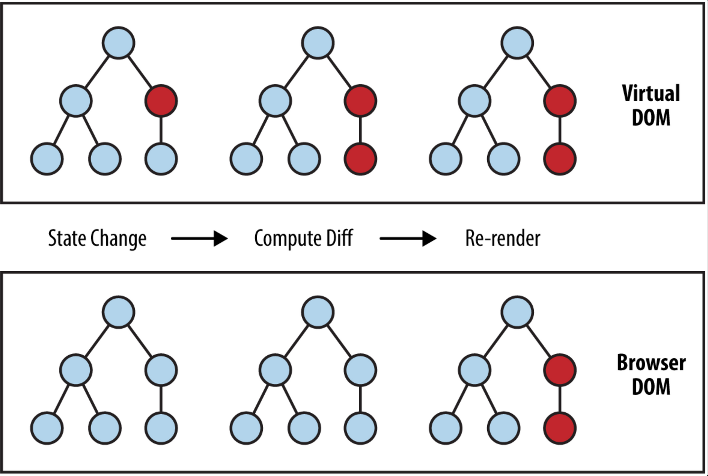
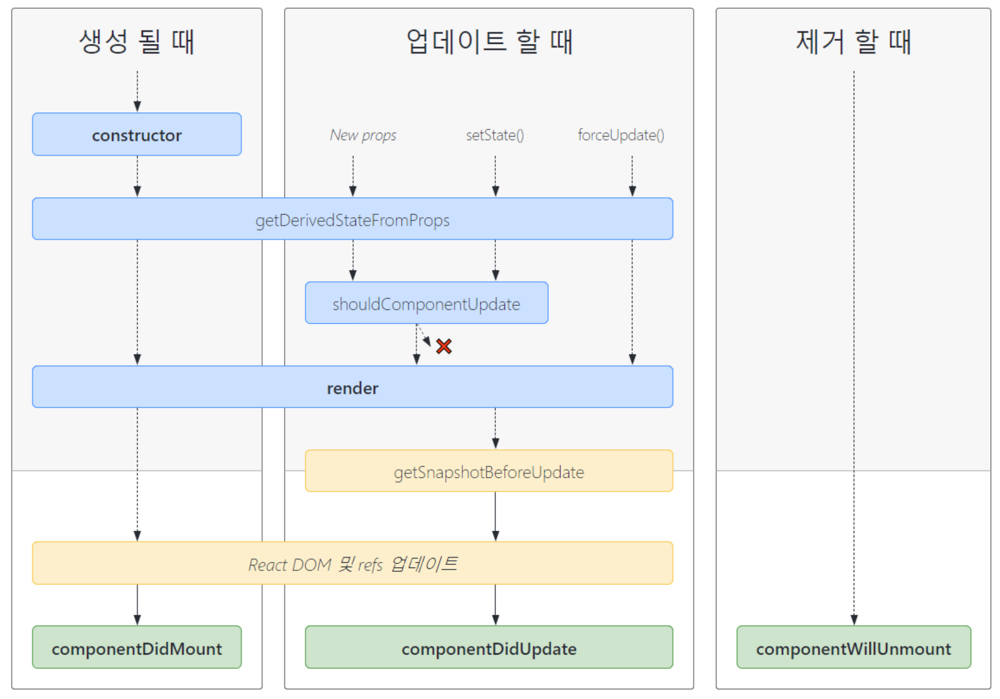
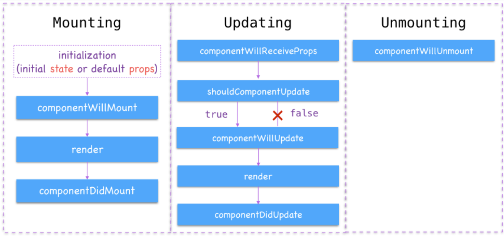
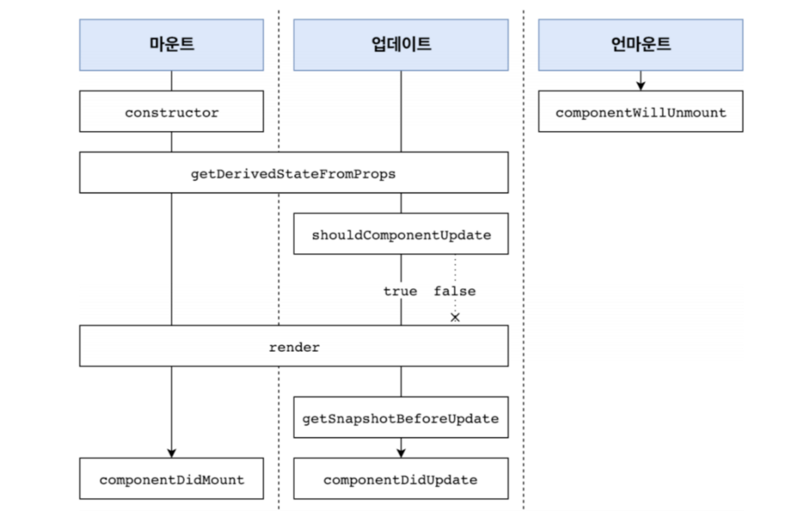

### 기본 개념

- 리액트는 UI 자바스크립트 라이브러리로써 싱글 페이지 애플리케이션의 UI(User Interface)를 생성하는데 집중한 라이브러리이다.
- 리액트는 자바스크립트에 HTML을 포함하는 JSX(JavaScript XML)이라는 문법을 사용한다
- 단방향 데이터 바인딩(One-way Data Binding)을 사용
- 가상 돔(Virtual DOM)이라는 개념을 사용하여 웹 애플리케이션의 퍼포먼스를 최적화한다

### 브라우저 렌더링

**웹 페이지가 렌더링 되는 과정**

1. HTML parser가 HTML을 바탕으로 DOM tree를 그린다.

2. CSS parser가 CSS를 바탕으로 CSSOM을 그린다.

3. DOM에 CSSOM을 적용하여 Render Tree를 그린다.

> **CSSOM**은 DOM에 CSS가 적용된 객체 모델 입니다.
>

4. Render Tree를 바탕으로 Painting 하여 실제 화면에 렌더링 한다.

- HTML 코드를 읽어 내려가다가 ``태그를 만나면 파싱을 잠시 중단하고 js 파일을 로드한다.

### React의 특징

1. React는 **선언형**이다.
2. React는 **컴포넌트 기반**으로 **재사용성**이 뛰어나다.
3. React는 **Virtual DOM(가상돔)**기반으로 가볍다.
4. React 컴포넌트는 **state**와 **props** 을 가진다.

### Virtual DOM(Document Object Model)

**DOM이란?**

- **DOM은 HTML, XML 문서의 프로그래밍 interface이다.**
  즉 DOM을 활용해서 그저 텍스트 파일이기만 했던 HTML이나 XML 문서(document)에 프로그래밍 언어가 접근할 수 있도록 한다.
- DOM은 이름 그대로 문서 구조를 트리 형태의 객체(Object)로 표현한다.
- 웹 브라우저는 DOM을 활용하여 객체에 자바스크립트와 CSS를 적용하게 된다.

동적으로 웹 페이지를 변경하다 보면 element의 생성, 수정, 제거 등 DOM을 변화시키는 수많은 연산이 생기게 된다. 웹 브라우저는 DOM을 활용하여 객체에 JS와 CSS를 적용하게 되는데, CSS 연산을 다시 하고 페이지를 리 페인트 하는 과정은 시간과 비용을 많이 소모하게 된다.

하지만, 그렇다고 DOM을 사용하지 않을 수도 없다. 결과적으로 웹 브라우저는 최종적으로 DOM을 보고 웹 페이지를 그리기 때문이다.

**virtual DOM : 가상 돔**

React는 Virtual DOM을 활용해 실제 DOM에 접근하여 조작하는 대신, 이를 추상화한 자바스크립트 객체를 구성하여 사용한다. 즉 동적으로 데이터가 변화했을 때 직접적으로 DOM을 조작하는 것이 아니라 DOM의 사본이라고 할 수 있는 새로운 Virtual DOM을 생성한다.

가상의 돔 트리를 사용해서 이전의 상태와 이후의 상태를 비교하여 변경된 부분의 DOM 만을 변경한다.

→ **조화 과정(reconciliation)**

- 가상돔은 자바스크립트 객체의 형태로 표현된다.
- 메모리 상에서 동작하기에 빠르면서 실제 렌더되는 것이 아니기에 연산 시간이 최소화된다.
- **Virtual DOM**과 **Real DOM** 을 비교하여 변경된 사항만 반영하여 해당 내용을 실제 돔에서 수정하고 렌더링한다.

> **참고
React에서 리렌더링이 일어나는 경우**
>
>
> 1. Props가 변경되었을 때
>
> 2. State가 변경되었을 때
>
> 3. forceUpdate() 를 실행하였을 때.
>
> 4. 부모 컴포넌트가 렌더링되었을 때
>

### Component Based Development

Component 단위로 개발을 해야한다.

**컴포넌트**는 독립적인 단위의 소프트웨어 모듈을 말한다. 즉 소프트웨어를 독립적인 하나의 부품으로 만드는 방법이다. 리액트는 웹에서 쓰는 각 요소들을 컴포넌트로 만들 수 있게 해 기존의 UI를 다른 화면에서 다시 쓰거나, 다른 프로젝트에서 다시 쓸 수 있도록 하는 장점(**높은 재사용성**)을 가진다.

- 독립적인 코드 블럭(HTML + CSS + Javascript)
- 중복되는 키워드를 하나의 컴포넌트로 표현하고 싶다.(이것을 이룬게 react이다.)
- 작업의 단위 = 컴포넌트

### 리액트 컴포넌트 생명주기

- 각각의 컴포넌트에는 라이프사이클 즉, 컴포넌트의 수명주기가 존재한다.
- 컴포넌트의 수명은 보통 페이지에서 렌더링 되기 전인 준비과정에서 시작하여 페이지에서 사라질 때 끝이 난다
- 라이프 사이클은 총 9개가 존재하며 크게 `**마운트(Mount), 업데이트(Update), 언마운트(Unmount)**`세 가지 유형으로 분류된다.
- 컴포넌트를 생성(마운팅)할 때는**`constructor -> componentWillMount -> render -> componentDidMount`**순으로 진행
- 컴포넌트를 제거(언마운팅)할 때는 **`componentWillUnMount`**메서드만 실행

### 마운팅(Mounting)

- **getDerivedStateFromProps**: 최초 마운트 시와 갱신 시 모두에서 `render`메서드를 호출하기 직전에 호출,  state를 갱신하기 위한 객체를 반환하거나,`null`을 반환
    - legacy - **componentWillMount :** 렌더링을 수행하기 전에 호출된다. 이 단계에서 상태를 설정하더라도 렌덜이이 다시 트리거되지 않는다.
- **componentDidMount**: 렌더링을 수행한 후에 호출된다. 이 시점에서 컴포넌트에 대한 DOM 표현이 생성되기 때문에 데이터 가져오기 등의 작업을 할 수 있다.

### 언마운팅(Unmounting)

- **componentWillUnMount**: 컴포넌트가 DOM에서 언마운팅되기 전에 호출된다.

### 속성 변경(Updating - prop)

- **getDerivedStateFromProps**: 최초 마운트 시와 갱신 시 모두에서 `render`메서드를 호출하기 직전에 호출,  state를 갱신하기 위한 객체를 반환하거나,`null`을 반환
    - legacy - **componentWillReceiveProps :** 컴포넌트가 새 속성을 받을 때 호출된다. 이 함수 안에 this.setState()를 호출해도 렌더링이 트리거되지 않는다.
- **shouldComponentUpdate**: render 함수보다 먼저 호출되는 함수이며, 해당 컴포넌트의 렌더링을 생략할 수 있는 기회를 제공한다.
- **componentWillUpdate**: 새로운 속성이나 상태를 수신하고 렌더링하기 전에 호출된다. 등록된 업데이트에만 이용해야 하며, 업데이트 자체를 트리거하지 않아야 하므로 this.setState를 통한 상태 변경은 허용되지 않는다.
- **componentDidUpdate**: 컴포넌트 업데이트가 DOM으로 플러시된 후에 호출된다.

### 상태 변경(Updating - state)

- (구)속성 변경과 거의 동일한 생명주기를 가지고 있지만, componentWillReceiveProps에 해당하는 메서드는 없다. 따라서 shouldComponentUpdate부터 시작된다.

