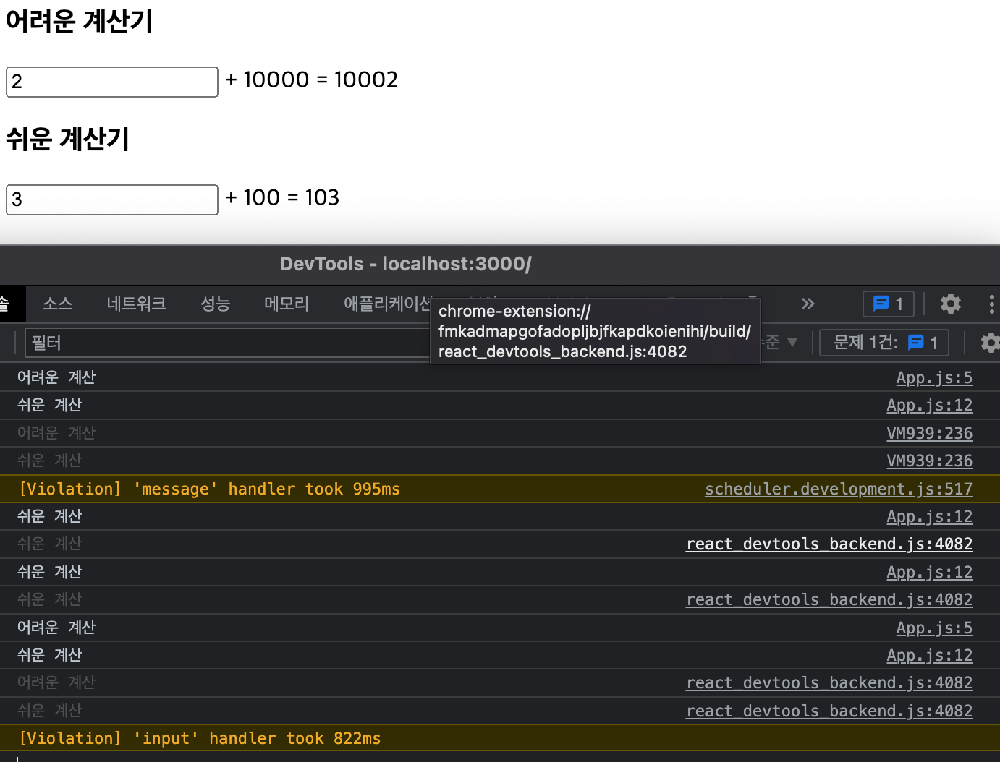
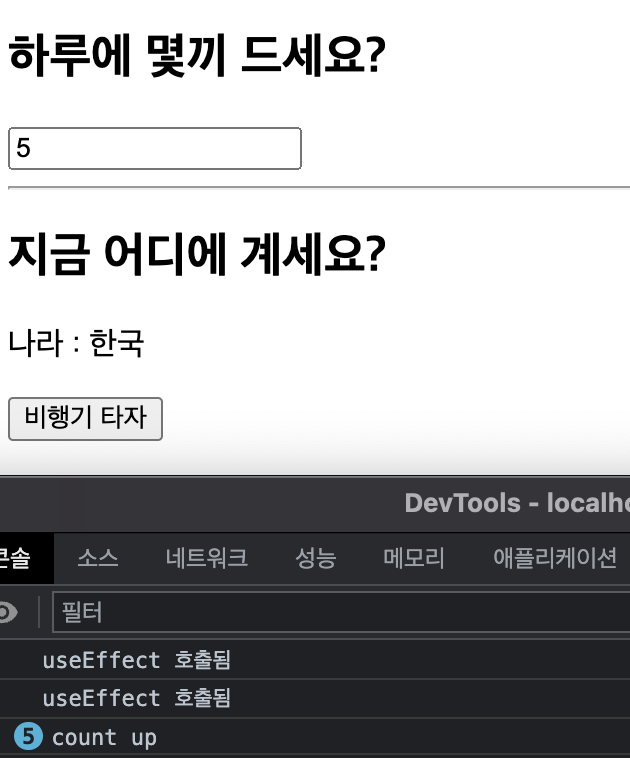

### useReducer

React에서 컴포넌트의 상태 관리를 위해 기본적으로 가장 많이 쓰이는 hook은 `setState()`
함수이지만. 좀 더 복잡한 상태 관리가 필요한 React 컴포넌트에서는 `setReducer()`
hook 함수를 사용할 수 있다.

- **한 컴포넌트 내에서 `State`를 업데이트하는 로직 부분을 그 컴포넌트로부터 분리시키는 것을 가능하**게 해준다(**`useReducer`는 `State` 업데이트 로직을 분리하여컴포넌트의 외부에 작성하는 것을 가능하게 함)**

  

  

  언제 `useReducer`를 사용하며, 언제 `useState`를 사용해야 하는지에 대한 정답은 없다고 하나 보편적으로 다음과 같이 사용한다

    - **useState**
        - 관리해야 할 `State`가 1개일 경우
        - 그 `State`가 단순한 숫자, 문자열 또는 `Boolean` 값일 경우
    - **useReducer**
        - 관리해야 할 `State`가 1개 이상, 복수일 경우
        - 혹은 현재는 단일 `State` 값만 관리하지만, 추후 유동적일 가능성이 있는 경우
        - 스케일이 큰 프로젝트의 경우
        - `State`의 구조가 복잡해질 것으로 보이는 경우

**useReducer를 사용하기 위한 구성 요소**

- useReducer 함수
- action
- dispatch 함수
- reducer 함수

> reducer -> state를 업데이트 하는 역할
>
>
> dispatch -> state업데이트를 위한 요구
>
> action ->요구의 내용
>



**useReducer()**

- useReducer() 패턴

    ```jsx
    const [<상태 객체>, <dispatch 함수>] = useReducer(<reducerFunc>, <initialState>, <init>)
    ```

    - **`state`**: 컴포넌트에서 사용할 `State(상태)`.
    - **`dispatch`**:  reducer 함수를 실행시키며, 컴포넌트 내에서 `state`의 업데이트를 일으키기 위해서 사용하는 함수. 자세한 것은 아래 dispatch 함수 항목을 참고.
    - **`reducer`**: 컴포넌트 외부에서 `state`를 업데이트하는 로직을 담당하는 함수. 현재의 `state`와 `action` 객체를 인자로 받아서, 기존의 `state`를 `대체(replace)`할 새로운 `State`를 `반환(return)`하는 함수. 자세한 것은 아래  reducer 함수 항목을 참고.
    - **`initialState`**: 초기 `State`
    - **`init`**: 초기 함수
- action
    - `action` 은 업데이트를 위한 정보를 가지고 있는 것이면 dispatch의 인자가 된다.
    - reducer함수의 두번째 인자인 action에 할당된다
    - action은 따로 정해진 형태는 없지만 `type` 이라는 값을 지닌 객체 형태로 사용된다

- dispatch
    - dispatch 함수는 reducer 함수를 실행시킨다
    - dispatch 함수의 인자로써 업데이트를 위한 정보를 가진 action을 이용하여 컴포넌트 내에서 state를 업데이트 시킨다
    - `dispatch 함수`의 인자인 action 은 reducer 함수의 두번째 인자인 `action`에 할당된다.
- reducer
    - `reducer 함수`는  dispatch함수**에 의해 실행**되며, 컴포넌트 외부에서 `state`를 업데이트하는 로직을 담당한다.
    - useReducer()의 첫번째 파라미터로 입력된 `reducer 함수`는,**현재의 `state`와 action 을 인자로 받게 되는데,이 값에 근거하여 기존의 `state`를 `대체(replace)`할 새로운 `state`를 `반환(return)`**한다.