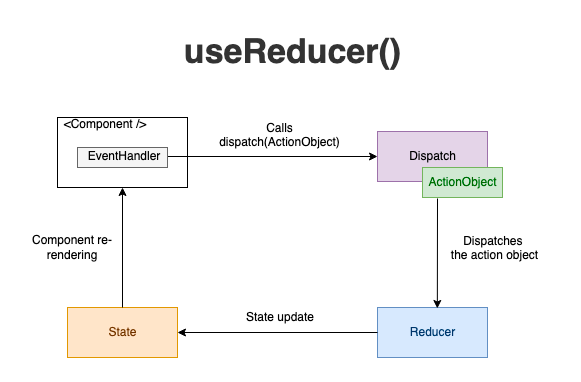

### useMemo

- memoization이란 기존에 수행한 연산의 결과값을 어딘가에 저장해두고 동일한 입력이 들어오면 재활용하는 프로그래밍 기법을 말한다.
- memoization을 절적히 적용하면 중복 연산을 피할 수 있기 때문에 메모리를 조금 더 쓰더라도 애플리케이션의 성능을 최적화할 수 있다.
- 함수형 컴포넌트는 렌더링 될 때 마다 다시 호출되며, 함수이기 때문에 함수의 로직들이 호출될 때 마다 반복적으로 수행된다.
- 만약에 컴포넌트 내부 로직에 복잡하거나 무거운 작업이 있다면 렌더링 될때마다 그러한 로직이 반복적으로 실행되는것은 바람직하지 않다.

리액트에서는 동일한 계산결과(자주필요한 값)를 최초 연산시 메모리에 캐싱하고 이후에 이 값을 필요할때 마다 다시 연산하지 않고 memoization 된 값을 재사용할 수 있도록 `useMemo()` 훅을 제공한다


### useMemo 사용법

```jsx
const value = useMemo(() => {
		return calculate();
},[item]);
```

- 첫번째 인자 → 콜백함수 : memoization 기법으로 캐싱하고자 하는 값을 계산하는 함수를 리턴
    - 콜백함수가 리턴하는 값 = `value`
- 두번째 인자 → 의존성 배열 : 배열안의 요소가 업데이트 될 때 memoization을 다시 실행한다. 만약 빈 배열을 입력할 경우 최초 렌더링 시점에만 memoization이 일어난다.

  > Memoization 기법은 애플리케이션에 따라 실행 속도를 향상시키는데 도움을 줄 수 있지만, 무분별하게 사용되어서는 안된다. 그 이유는 memoization 기법 자체가 메모리라는 시스템 자원을 소비해서 저장하는 것이기 때문에 지나치게 사용되면 성능에 악영향을 줄 수 있다.
>


### Memoization 예제

- `hardCalculator()` 함수는 연산량이 많도록 임의로 루프를 돌도록 설정
- `easyCalculator()` 함수는 단순하게 값을 더해서 리턴하도록 설정

`hardSum` 변수를 memoization하지 않을 경우 해당 컴포넌트 함수에서 `easyNumber`(state)가 업데이트 되는 경우에도 렌더링이 발생하게 되어 `hardCalculator` 연산이 일어나게 될 것이다.

→ useMemo()를 사용해서 `hardSum` 변수를  `hardNumber` 값이 변경되었을 경우에 memoization 하도록 설정

```jsx
import './App.css';
import {useEffect, useMemo, useState} from "react";

function hardCalculator(number) {
    console.log("어려운 계산")
    for (let i = 0; i < 999999999; i++) {}

    return number + 10000;
}

function easyCalculator(number) {
    console.log("쉬운 계산")
    return number + 100;
}

function App() {

    const [hardNumber, setHardNumber] = useState(1);
    const [easyNumber, setEasyNumber] = useState(1);

    // const hardSum = hardCalculator(hardNumber);
    const hardSum = useMemo(() => {
        return hardCalculator(hardNumber);
    },[hardNumber])

    const easySum = easyCalculator(easyNumber);

    return (
        <div className="App">
            <h3>어려운 계산기</h3>
            <input type="number" value={hardNumber} onChange={(e) => {
                setHardNumber(parseInt(e.target.value))
            }}/>
            <span> + 10000 = {hardSum}</span>

            <h3>쉬운 계산기</h3>
            <input type="number" value={easyNumber} onChange={(e) => {
                setEasyNumber(parseInt(e.target.value))
            }}/>
            <span> + 100 = {easySum}</span>
        </div>
    );
}

export default App;
```


→ 최초 렌더링 후 easyCalculator를 실행하여 전체 다시 렌더링이 되더라도 hardCalculator가 실행되지 않는다

**memoization의 리턴값이 객체인 경우**

- useEffect()는  location 이 변할경우에 로그를 출력하도록 설정한다 → 이 때 두가지의 경우를 생각해볼 수 있다
    1. location이 primitive형인 경우
    2. location이 객체 타입인 경우
    - 1의 경우 number 라는 state가 변하는 경우에 렌더링이 다시 일어나더라도 location의 문자열을 비교하면 변하지 않았기 때문에 useEffect를 실행하지 않는다
    - 2의 경우 number 라는 state가 변하는 경우에 렌더링이 다시 일어나면 App()이라는 컴포넌트 함수가 다시 호출되고, 이에 따라 location이 참조하는 객체의 주소값이 달라지므로 location이 달라졌다고 판단하여 useEffect를 실행한다
- 이를 해결하기 위해 useMemo를 사용하여 location 객체를 캐싱해두면 렌더링 시 동일한 객체를 가져올 수 있어 useEffect()가 실행되지 않는다

```jsx
import './App.css';
import {useEffect, useMemo, useState} from "react";

function App() {

    const [number, setNumber] = useState(0);
    const [isKorea, setIsKorea] = useState(true);

    // const location = isKorea ? '한국' : '외국';

    const location = useMemo(() => {
        return {country: isKorea ? '한국' : '외국'}
    },[isKorea]);

    useEffect(() => {
        console.log('useEffect 호출됨')
    }, [location])

    return (
        <div className="App">
            <h2>하루에 몇끼 드세요?</h2>
            <input type="number" value={number} onChange={(e) => {
                setNumber(e.target.value)
            }}/>
            <hr/>

            <h2>지금 어디에 계세요?</h2>
            <p>나라 : {location.country}</p>
            <button onClick={() => {
                setIsKorea(!isKorea)
            }}>비행기 타자
            </button>
        </div>
    );
}

export default App;
```



최초 useEffect 실행 이후 number를 올려 렌더링이 다시 일어나더라도 객체타입의 변수를 memoization 해두었기 때문에 useEffect가 호출되지 않음