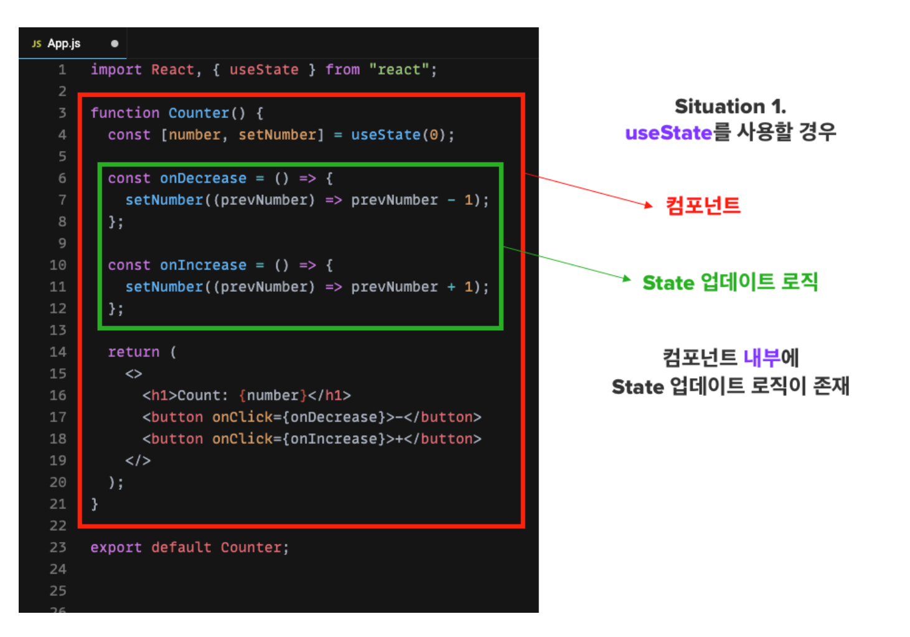

### useContext

react에서 context api는 앱 안에서 전역적으로 사용되는 데이터들을 여러 컴포넌트들이 공유할 수 있는 방법을 제공해 준다

react에서의 일반적인 데이터 흐름은 부모 컴포넌트에서 자식 컴포넌트로props를 통해 전달된다.



- 상위 컴포넌트에서 하위 컴포넌트로 props를 통해 데이터를 전달하는 과정을 prop Drilling이라고 한다
- C, E 컴포넌트에서 App컴포넌트의 데이터를 필요하다고 가정하면, 중간의 컴포넌트는 해당 데이터가 필요하지 않음에도 불구하고 데이터가 거쳐가게 된다.
    - 코드 복잡성 증가

props 대신에 context를 사용해서 데이터를 공유하면 상위 컴포넌트에 있는 데이터를 모든 자녀 컴포넌트들이 useContext를 통해 데이터를 사용할 수 있게 된다.

단, context를 사용하면 컴포넌트를 재사용하기 어려워 질 수 있으므로 반드시 필요한 경우에만 사용한다.

context API를 사용하기 위해서는 `Provider` , `Consumer` , `createContext` 이렇게 세가지 개념을 알고 있으면 된다.

- `createContext` : context 객체를 생성한다.
- `Provider` : 생성한 context를 하위 컴포넌트에게 전달하는 역할을 한다.
- `Consumer` : context의 변화를 감시하는 컴포넌트이다.

### Context 예제

**App.js**

```jsx
import React, { createContext } from "react";
import Children from "./Children";

// AppContext 객체를 생성한다.
export const AppContext = createContext();

const App = () => {
  const user = {
    name: "박종현",
    job: "백수"
  };

  return (
    <>
      <AppContext.Provider value={user}>
        <div>
          <Children />
        </div>
      </AppContext.Provider>
    </>
  );
};

export default App;

```

**Children.js**

- `<AppContext.Consumer>` 태그로  컴포넌트를 감싸서 컨텍스트 적용

```jsx
import React from "react";
import { AppContext } from "./App";

const Children = () => {
  return (
      <AppContext.Consumer>
        {(user) => (
          <>
            <h3>AppContext에 존재하는 값의 name은 {user.name}입니다.</h3>
            <h3>AppContext에 존재하는 값의 job은 {user.job}입니다.</h3>
          </>
        )}
      </AppContext.Consumer>
  );
};

export default Children;

```

- 이 예제 에서는 하나의 컴포넌트에서만 context를 사용했지만 여러 컴포넌트에서 사용할 경우 코드가 점점 복잡해짐(중복 발생)

**Children.js → useContext 를 적용**

```jsx
import React, { useContext } from "react";
import { AppContext } from "./App";

const Children = () => {
  // useContext를 이용해서 따로 불러온다.
  const user = useContext(AppContext);
  return (
    <>
      <h3>AppContext에 존재하는 값의 name은 {user.name}입니다.</h3>
      <h3>AppContext에 존재하는 값의 job은 {user.job}입니다.</h3>
    </>
  );
};

export default Children;

```

App.js 에서 Context를 생성하고 Provider를 통해 전달하는 코드는 그대로

`AppContext` 를 사용하는 과정이  `const user = useContext(AppContext)`를 통해 Context를 불러 온 후 바로 사용이 가능하게 바뀌었다.

따라서 useContext 를 사용하면 기존의 Context 사용 방식보다 더 쉽고 간단하게 Context를 사용이 가능하고, 앞서 다뤘던 useState, useEffect와 조합해서 사용하기 쉽다는 장점이 있다