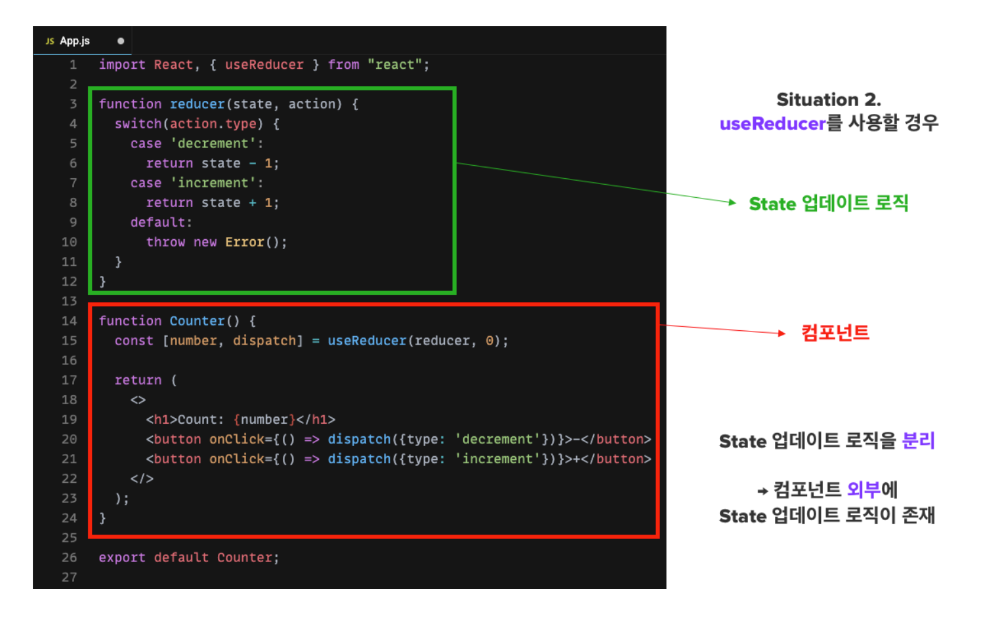

### useRef

- React 컴포넌트는 기본적으로 State가 변할때 마다 다시 렌더링 된다
- 함수형 컴포넌트는 함수이기 때문에 렌더링이 될 때 마다 다시 호출되게 된다

  → 컴포넌트 함수가 다시 호출이 된다는 것은 함수 내부의 변수들이 모두 다시 초기화가 되고 함수의 모든 로직이 다시 실행된다는 것을 의미


**다시 랜더링 되어도 동일한 참조값을 유지하려면?**

컴포넌트 내부 변수의 저장공간이 필요하다. 이 때 사용하는 것이 useRef Hook이다.

useRef로 선언한 변수는 값이 변하더라도 렌더링이 일어나지 않고, 렌더링이 일어나더라도 값을 유지할 수 있다

```jsx
const 변수명 = useRef(초기값)
```

- 위와같이 useRef는 변수명과 초기값을 설정하여 선언할 수 있다
- ref값을 사용할 경우 `변수명.current` 로 가져올 수 있다.
- ref값을 변경하려면 `변수명.current = ...` 로 변경시킬 수 있다

> 정리
>
>
> state 변화 → 렌더링 → 컴포넌트 내부 변수들 초기화
>
> ref변화 →  No 렌더링 → 변수들의 값이 유지됨
>
> state의 변화 → 렌더링 → ref의 값 유지됨
>

### 예시

**useRef() 작동 이해**

```jsx
import {useState, useRef, useEffect} from "react";

function App() {

    const [countState, set_countState] = useState(0);
    const countRef = useRef(0)
    let countVar = 0
    const totalRenderingCnt = useRef(0)

    useEffect(() => {
        totalRenderingCnt.current = totalRenderingCnt.current + 1;
        console.log("렌더링 수 : ", totalRenderingCnt.current)
    })

    function increaseCountState() {
        set_countState(countState + 1)
    }

    function increaseCountRef() {
        countRef.current = countRef.current + 1
        console.log("Ref : ",countRef);
    }

    function increaseCountVar() {
        countVar = countVar + 1;
        console.log("Var : ",countVar);
    }

    function pringResult() {
        console.log("state ; ", countState "ref : ", countRef.current, "var : ", countVar )
    }

    return (
        <div className="App">
            <p>State : {countState}</p>
            <p>Ref : {countRef.current}</p>
            <p>Var : {countVar}</p>
            <button onClick={increaseCountState}>State 증가</button>
            <button onClick={increaseCountRef}>Ref 증가</button>
            <button onClick={increaseCountVar}>Var 증가</button>
            <button onClick={pringResult}>state, ref, var 출력</button>

        </div>
    );
}

export default App;
```

1. state 증가, ref 증가, var 증가 각 3회후 출력버튼
    - state값은 버튼을 클릭할 때마다 렌더링 되므로 화면에 표현됨
    - ref, var 값은 변화시켜도 렌더링 되지 않으므로 화면에 표시되지 않지만 콘솔창에 로그로 남겨짐

   

2. state값 증가 (렌더링 유발)
    - state값을 증가시켜 렌더링이 일어난 결과 ref값은 유지되었으나 var 값은 함수 재호출로 인해 초기화 되는 것을 알 수 있다.

   


**Dom 요소 접근(포커스)**

```jsx
import{useState, useRef, useEffect}from"react";

functionApp() {

		constinputRef = useRef();
		
		useEffect(() => {
				inputRef.current.focus()
		},[])
		
		
		functionlogin() {
		        alert(`welcome ${inputRef.current.value}!`)
		        inputRef.current.focus()
		    }
		
		return(
		        <div className="App">
		
		            <input ref={inputRef}type="text"placeholder="username"/>
		            <buttonon Click={login}>login</button>
		
		        </div>
		    );
}

export defaultApp;

```

- useRef로 특정 DOM 선택하기 : input 노드의 ref속성에  useRef()로 생성한 변수 입력

  → 특정 컴포넌트에서 특정 DOM을 선택해야할 때 ref 속성을 사용해야하고, 함수형 컴포넌트에서 이를 설정할 때는 useRef를 사용하여 설정

- useEffect로 최초 렌더링시 DOM에 접근한 ref 값에 포커스 하도록 설정